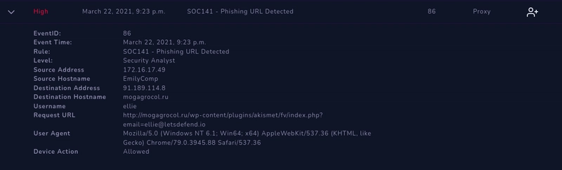

SOC Incident Report — Event ID 86: Phishing URL Detected
Executive Summary

On September 10th at 06:00 AM, the SOC detected a phishing URL alert (Event ID: 86) originating from host EmilyComp (user: ellie).
The alert was triggered by outbound traffic to a known suspicious domain (mogagrocol.ru), hosted in the Russian Federation.

Subsequent investigation confirmed that the request originated from the internal IP 172.16.17.49 and targeted a phishing page via HTTP.
Further analysis of correlated email logs revealed delivery of a phishing email containing a malicious ZIP attachment exploiting CVE-2017-0199 / Follina exploit.

The incident was determined to be a true positive phishing attack, requiring containment and remediation actions.

Incident Details

Event ID: 86 SOC141
Incident Type: Proxy (Phishing URL Detected)
Created Date: September 10, 06:00 AM
Source Host: EmilyComp (172.16.17.49)
Destination Host: mogagrocol.ru (91.189.114.8)
Username: ellie
Request URL:
http://mogagrocol.ru/wp-content/plugins/akismet/fv/index.php?email=ellie@letsdefend.io

Device Action: Allowed

Log Evidence
Proxy Log Extract
type: Proxy
source_address: 172.16.17.49
source_port: 55662
destination_address: 91.189.114.8
destination_port: 80
time: Mar 22, 2021, 09:23 PM
Request URL: http://mogagrocol.ru/wp-content/plugins/akismet/fv/index.php?email=ellie@letsdefend.io

Threat Intelligence Findings

VirusTotal (URL): 10/98 vendors flagged as malicious

URLScan.io:
Domain: mogagrocol.ru
Hosted in Russia (RU-CENTER JSC)
Previously scanned >750 times, flagged as malicious
Multiple related IP communications observed

Email Correlation:
From: radiosputnik@ria.ru

To: jonas@letsdefend.io
Subject: Invitation for an interview
Attachment: 05-2022-0438.doc.zip

VirusTotal: 3/64 flagged as malicious
Detection: MSOffice/Follina Exploit (CVE-2017-0199)

Incident Response Workflow
1. Detection

Alert triggered by outbound HTTP request to known phishing domain.

URL flagged by multiple AV vendors as malicious.

2. Analysis

Confirmed traffic originated from user ellie on EmilyComp.

Destination: Russian Federation IP (91.189.114.8).

Cross-referenced with phishing email containing malicious DOCX exploiting Follina.

Endpoint exhibited suspicious command execution linked to malware download (KBDYAK.exe).

3. Containment

Isolated endpoint (EmilyComp) from network to prevent further propagation.

Blocked domain mogagrocol.ru and related IOCs at proxy/firewall level.

Alerted affected user(s) and IT support.

4. Remediation

Removed malicious attachment and blocked similar email signatures at email security gateway.

Conducted AV/EDR scans on affected endpoint.

Applied Microsoft patching for CVE-2017-0199 & Follina exploitation vector.

Restored endpoint from clean image.

5. Recovery & Monitoring

Monitored network logs for recurrence of IOCs.

Confirmed no lateral movement or additional compromised endpoints.

6. Documentation

Collected all artifacts and Indicators of Compromise (IOCs).

Compiled analyst notes into final SOC case report.

Indicators of Compromise (IOCs)

Domain: mogagrocol.ru
IP Address: 91.189.114.8, 195.24.68.4
Malicious Attachment: 05-2022-0438.doc.zip
File Hash (SHA256): 90a1a94f5f9efce66697129bd4267b5e5102eec7446d51b769882360ae035b19
Malware Executable: KBDYAK.exe
Exploit Used: CVE-2017-0199 / Follina

Conclusion
This incident was a confirmed phishing attack leveraging a malicious URL and document exploit to attempt compromise of an internal host.
The SOC successfully detected, analyzed, and contained the threat.

Verdict: True Positive
Impact: Limited to single endpoint, contained before lateral spread
Actions Taken: Containment, remediation, patching, user notification
Preventive Recommendations:
Enforce email attachment sandboxing
Block known malicious domains at proxy/DNS level
Conduct phishing awareness training for users
Ensure patch management is enforced against known exploits
