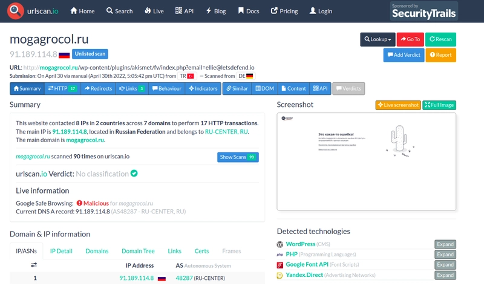
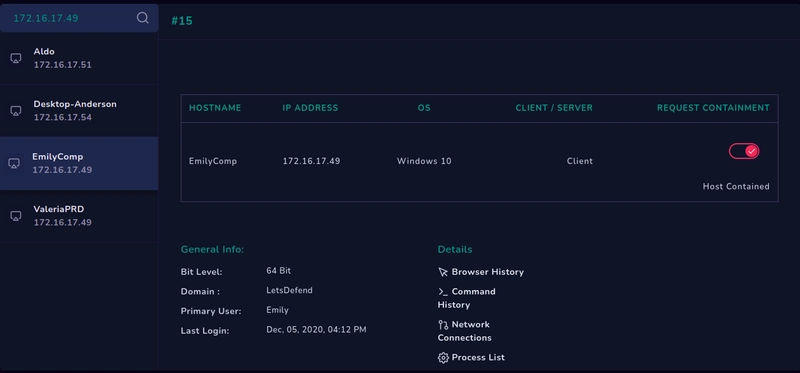

<h1 align="center">🔎 SOC141 Incident Report</h1>
<h3 align="center">Event ID 86: Phishing URL Detected</h3>

---

## 📌 Executive Summary

On <b>September 10th at 06:00 AM</b>, the SOC detected a phishing URL alert 
(<b>Event ID: 86</b>) originating from host <b>EmilyComp</b> (user: <code>ellie</code>).  
The alert was triggered by outbound traffic to a known suspicious domain 
(<code>mogagrocol.ru</code>), hosted in the Russian Federation.  
  
Investigation confirmed that the request originated from 
<code>172.16.17.49</code> and targeted a phishing page via HTTP.  
Correlated email logs revealed delivery of a phishing email containing a 
malicious ZIP attachment exploiting <b>CVE-2017-0199 / Follina</b>.  
  
<b>Verdict:</b> True Positive phishing attack, requiring containment and remediation.

---

## 📝 Incident Details
<table>
<tr><td><b>Event ID</b></td><td>86 SOC141</td></tr>
<tr><td><b>Incident Type</b></td><td>Proxy (Phishing URL Detected)</td></tr>
<tr><td><b>Created Date</b></td><td>September 10, 06:00 AM</td></tr>
<tr><td><b>Source Host</b></td><td>EmilyComp (172.16.17.49)</td></tr>
<tr><td><b>Destination Host</b></td><td>mogagrocol.ru (91.189.114.8)</td></tr>
<tr><td><b>Username</b></td><td>ellie</td></tr>
<tr><td><b>Request URL</b></td>
<td>
<code>http://mogagrocol.ru/wp-content/plugins/akismet/fv/index.php?email=ellie@letsdefend.io</code>
</td></tr>
<tr><td><b>Device Action</b></td><td>Allowed ❌</td></tr>
</table>

  

---

## 📂 Log Evidence
<pre>
type: Proxy
source_address: 172.16.17.49
source_port: 55662
destination_address: 91.189.114.8
destination_port: 80
time: Mar 22, 2021, 09:23 PM
Request URL: 
http://mogagrocol.ru/wp-content/plugins/akismet/fv/index.php?email=ellie@letsdefend.io
</pre>

---

## 🌐 Threat Intelligence Findings
- **VirusTotal (URL):** 10/98 vendors flagged as malicious  
- **URLScan.io:**  
  - Domain: `mogagrocol.ru`  
  - Hosted in Russia (RU-CENTER JSC)  
  - Previously scanned >750 times, flagged as malicious  
  - Multiple related IP communications observed  
- **Email Correlation:**  
  - From: `radiosputnik@ria.ru`  
  - To: `jonas@letsdefend.io`  
  - Subject: *Invitation for an interview*  
  - Attachment: `05-2022-0438.doc.zip`  
  - Detection: *MSOffice/Follina Exploit (CVE-2017-0199)*  

  

---

## 🚨 Incident Response Workflow
### 1. Detection
- Outbound HTTP request to malicious domain  
- URL flagged by multiple AV vendors  

### 2. Analysis
- Origin: User **ellie** on host **EmilyComp**  
- Destination IP: **91.189.114.8** (Russia)  
- Correlated phishing email with malicious DOCX exploit  
- Suspicious command execution → dropped `KBDYAK.exe`  

### 3. Containment
- Isolated host from network  
- Blocked domain + related IOCs at proxy/firewall  
- Alerted users & IT support  

### 4. Remediation
- Removed malicious attachment  
- Blocked similar email signatures  
- AV/EDR scans + patching  
- Restored endpoint from clean image  

### 5. Recovery & Monitoring
- Ongoing IOC monitoring  
- No lateral movement detected  

### 6. Documentation
- Collected artifacts & IOCs  
- Compiled final SOC report  

---

## 🛑 Indicators of Compromise (IOCs)
| Type | Value |
|------|-------|
| **Domain** | mogagrocol.ru |
| **IP Address** | 91.189.114.8, 195.24.68.4 |
| **Malicious Attachment** | 05-2022-0438.doc.zip |
| **File Hash (SHA256)** | 90a1a94f5f9efce66697129bd4267b5e5102eec7446d51b769882360ae035b19 |
| **Malware Executable** | KBDYAK.exe |
| **Exploit Used** | CVE-2017-0199 / Follina |

  

---

## ✅ Conclusion
This was a **confirmed phishing attack** leveraging a malicious URL and document exploit.  
The SOC successfully **detected, analyzed, contained, and remediated** the threat.  

- **Verdict:** True Positive  
- **Impact:** Limited to one endpoint, no lateral spread  
- **Actions Taken:** Containment, remediation, patching, user awareness  

### 🔒 Preventive Recommendations
- Enforce **email attachment sandboxing**  
- Block malicious domains at **proxy/DNS level**  
- Conduct **phishing awareness training**  
- Ensure **patch management** for CVEs  
